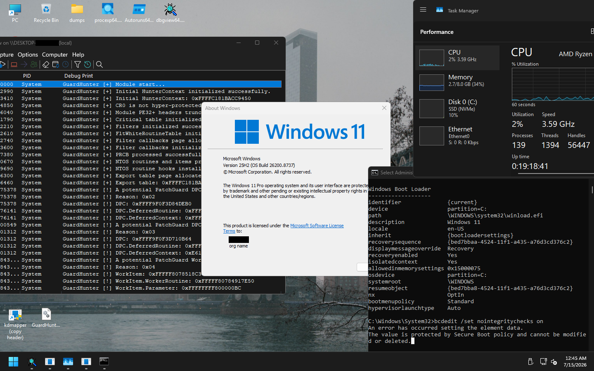

# GuardHunter - Defeating PatchGuard in RT Phase

GuardHunter is an NT kernel module that serves as a highly effective solution for neutralizing PatchGuard during the RT phase, and can be used as a comprehensive offensive/defensive framework for NTOS.

## Requirements

- When mapping the module PE image to memory, the PE headers must be copied.

- The module must run in an environment where Virtualization-Based Security (VBS) is disabled.

- Under Secure Boot, the module must be loaded into the kernel via manual mapping.

## Tested Windows Builds

The module was successfully tested on Windows builds:

- 26200.8737

## Test Results

## Authors

- [quokka867](https://github.com/quokka867)