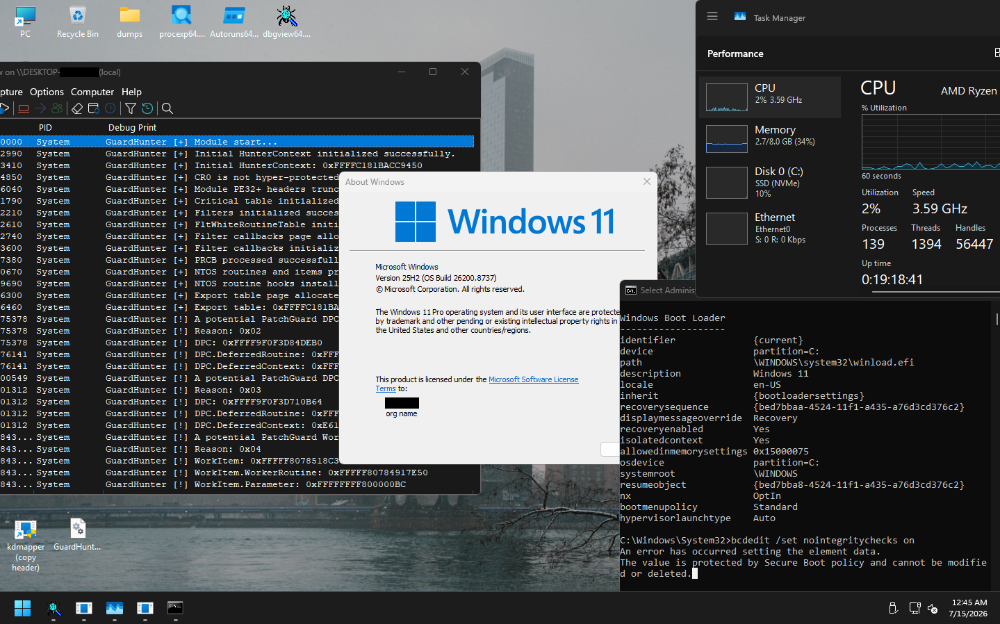

# GuardHunter - Defeating PatchGuard in RT Phase

GuardHunter is an NT kernel module that serves as a highly effective solution for neutralizing PatchGuard during the RT phase, and can be used as a comprehensive offensive / defensive framework for NTOS.

## Requirements

- When mapping the module PE image to memory, the PE headers must be copied.

- The module must run in an environment where Virtualization-Based Security (VBS) is disabled.

- Under Secure Boot, the module must be loaded into the kernel via manual mapping.

## Recommendations

- The module must be initialized within approximately 2 minutes and 10 seconds of system startup to prevent potential desynchronization that would result in bug check 0x109 (CRITICAL_STRUCTURE_CORRUPTION).

## Tested Windows Builds

The module was successfully tested on Windows builds:

- 26200.8737 / 26200.8973

## Test Results

## Authors

- [quokka867](https://github.com/quokka867)